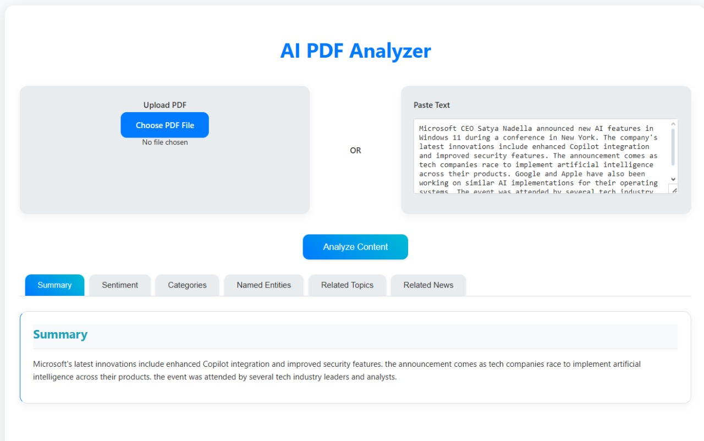

# Text Analysis and Summarization Tool

A comprehensive web application that leverages state-of-the-art Natural Language Processing (NLP) models to provide advanced text analysis capabilities. This tool is designed to help users understand, summarize, and analyze text content through various AI-powered features.

## Output Screenshots

### Output Image


## 🚀 Features

### 1. Text Summarization
- **Model**: T5-base
- **Capabilities**: 
  - Generates concise summaries of long texts
  - Maintains key information and context
  - Adjustable summary length
  - Handles various text formats and lengths

### 2. Sentiment Analysis
- **Model**: RoBERTa-base
- **Capabilities**:
  - Analyzes text sentiment (positive, negative, neutral)
  - Provides sentiment scores
  - Identifies emotional tone
  - Works with various text lengths

### 3. Entity Recognition
- **Model**: BERT-large
- **Capabilities**:
  - Extracts named entities (people, organizations, locations)
  - Categorizes entities by type
  - Provides confidence scores
  - Groups related entities

### 4. Category Detection
- **Model**: BART-large
- **Capabilities**:
  - Identifies text categories (politics, technology, sports, etc.)
  - Provides category confidence scores
  - Handles multiple categories per text
  - Supports custom category definitions

### 5. Related Topics Discovery
- **Integration**: Wikipedia API
- **Capabilities**:
  - Finds related topics and concepts
  - Provides topic summaries
  - Links to detailed information
  - Suggests related research areas

### 6. News Integration
- **Integration**: NewsAPI
- **Capabilities**:
  - Finds related news articles
  - Provides article summaries
  - Links to source articles
  - Filters by relevance and date

### 7. PDF Processing
- **Library**: PyPDF2
- **Capabilities**:
  - Extracts text from PDF documents
  - Handles various PDF formats
  - Preserves text structure
  - Supports batch processing

### 8. User Interface
- **Features**:
  - Dark/Light mode support
  - Responsive design
  - Real-time processing
  - Interactive results display
  - User-friendly input methods

## 🛠 Technical Stack

### Backend Technologies
- **Flask**: Lightweight web framework for Python
  - Handles routing and request processing
  - Manages API endpoints
  - Provides template rendering
  - Handles file uploads

- **PyTorch**: Deep learning framework
  - Powers all NLP models
  - Handles model inference
  - Manages GPU acceleration
  - Provides model optimization

- **Transformers**: Hugging Face library
  - Provides pre-trained models
  - Handles tokenization
  - Manages model pipelines
  - Supports model fine-tuning

### Frontend Technologies
- **HTML5**: Structure and content
- **CSS3**: Styling and layout
- **JavaScript**: Interactive features
- **Bootstrap**: Responsive design

### External Services
- **NewsAPI**: News article integration
- **Wikipedia API**: Topic research
- **DuckDuckGo Search**: Web search capabilities

## 📋 Setup Instructions

### Prerequisites
- Python 3.8 or higher
- pip (Python package manager)
- Git
- Virtual environment (recommended)

### Installation Steps

1. **Clone the Repository**
   ```bash
   git clone <repository-url>
   cd project
   ```

2. **Create and Activate Virtual Environment**
   ```bash
   # Windows
   python -m venv venv
   venv\Scripts\activate

   # Linux/Mac
   python3 -m venv venv
   source venv/bin/activate
   ```

3. **Install Dependencies**
   ```bash
   pip install -r requirements.txt
   ```

4. **Environment Configuration**
   Create a `.env` file in the project root:
   ```env
   NEWSAPI_KEY=your_api_key_here
   FLASK_ENV=development
   FLASK_DEBUG=1
   ```

5. **Run the Application**
   ```bash
   python app.py
   ```

6. **Access the Application**
   Open your browser and navigate to:
   ```
   http://localhost:5000
   ```

## 📝 Usage Guide

### Input Methods
1. **Text Input**
   - Direct text pasting
   - File upload (PDF)
   - URL input (coming soon)

### Analysis Process
1. **Text Processing**
   - Text cleaning and normalization
   - Tokenization
   - Model inference
   - Result aggregation

2. **Result Display**
   - Summary section
   - Sentiment analysis
   - Entity recognition
   - Category classification
   - Related topics
   - News articles

### Output Features
- **Downloadable Results**
- **Shareable Links**
- **Export Options**
- **Print Functionality**

## 🔌 API Documentation

### Main Endpoint
```
POST /
```

#### Request Parameters
- **text_input**: String (optional)
- **pdf_file**: File (optional)
- **max_length**: Integer (optional)
- **min_length**: Integer (optional)

#### Response Format
```json
{
  "summary": "string",
  "sentiment": {
    "label": "string",
    "score": float
  },
  "entities": [
    {
      "text": "string",
      "type": "string",
      "score": float
    }
  ],
  "categories": [
    {
      "label": "string",
      "score": float
    }
  ],
  "related_topics": [
    {
      "topic": "string",
      "summary": "string",
      "url": "string"
    }
  ],
  "related_news": [
    {
      "title": "string",
      "url": "string",
      "source": "string",
      "date": "string"
    }
  ]
}
```

## 📦 Dependencies

### Core Dependencies
- **torch**: Deep learning framework
- **transformers**: NLP models and pipelines
- **datasets**: Data handling and processing
- **flask**: Web framework
- **rouge-score**: Text summarization evaluation
- **numpy**: Numerical computations
- **PyPDF2**: PDF processing
- **scipy**: Scientific computing
- **requests**: HTTP requests
- **wikipedia**: Wikipedia API integration
- **python-dotenv**: Environment variable management

### Development Dependencies
- **pytest**: Testing framework
- **black**: Code formatting
- **flake8**: Code linting
- **pylint**: Code analysis

## 🤝 Contributing

### Development Setup
1. Fork the repository
2. Create a feature branch
3. Set up development environment
4. Make changes
5. Run tests
6. Submit pull request

### Code Guidelines
- Follow PEP 8 style guide
- Write meaningful commit messages
- Include tests for new features
- Update documentation
- Maintain backward compatibility

### Testing
```bash
pytest tests/
```

### Code Formatting
```bash
black .
flake8 .
```

## 📄 License

This project is licensed under the MIT License - see the [LICENSE](LICENSE) file for details.

## 🙏 Acknowledgments

- **Hugging Face**: For providing state-of-the-art transformer models
- **NewsAPI**: For news article integration
- **Wikipedia**: For topic research capabilities
- **PyTorch Team**: For the deep learning framework
- **Flask Team**: For the web framework
- **Open Source Community**: For various libraries and tools

## 📞 Support

For support, please:
1. Check the documentation
2. Search existing issues
3. Create a new issue
4. Contact the maintainers

## 📈 Roadmap

### Planned Features
- [ ] Multi-language support
- [ ] Custom model training
- [ ] API rate limiting
- [ ] User authentication
- [ ] Batch processing
- [ ] Advanced analytics
- [ ] Mobile application
- [ ] Browser extension 